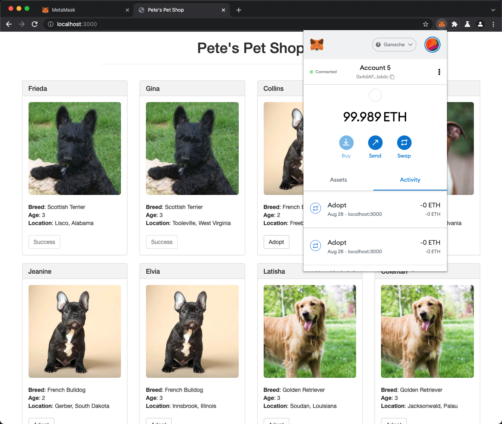
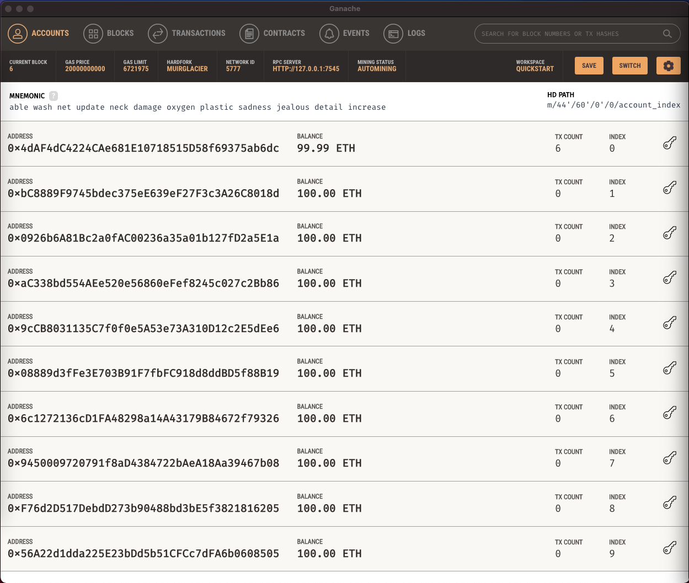
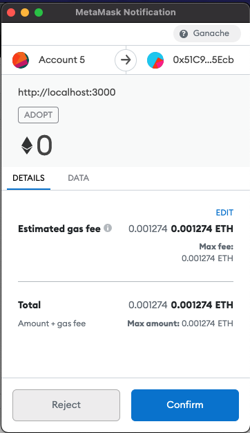
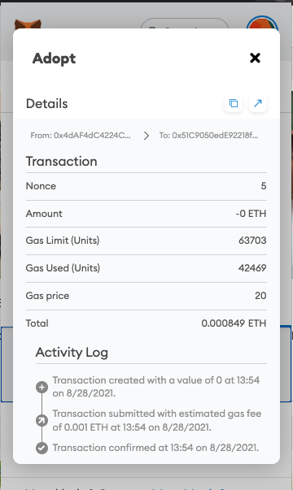

# DApp - Pet Shop Tutorial
This is just my repository of the Truffle tutorial, https://www.trufflesuite.com/tutorial.

# What I Learn
- Init Truffle Project
- Write simple Smart Contract in Solidity
- Running local Etherium Blockchain network on my machine
- Config Metamask to connect to my local blockchain
- Deploy Smart Contract with Truffle Migration
- Write unit test for Smart Contract
- Interect to Smart Contract from website with Web3

# Screenshort

